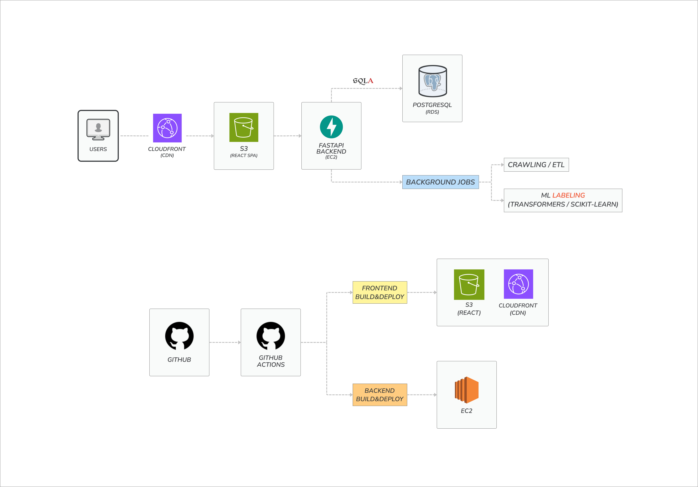

# BeRealDev
Automated Developer Technology Trend Collection &amp; Analysis Platform

This service is built with a React frontend deployed on S3 and CloudFront, a FastAPI backend running on EC2, and PostgreSQL on RDS.
Background jobs handle crawling, ETL, and ML-based labeling asynchronously using Celery or Cron.

